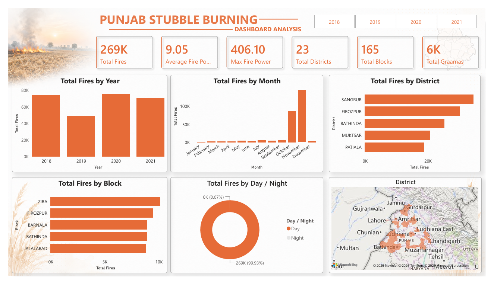

# 🔥 Punjab Stubble Burning Analysis (2018–2021)

## 📌 Project Overview

This project presents an end-to-end data analytics workflow to analyze stubble burning incidents across Punjab using satellite observation data from **2018 to 2021**. The objective is to clean and preprocess the dataset, identify temporal and geographical patterns, derive meaningful insights, and build an interactive Power BI dashboard to support data-driven environmental decision-making.

---
## 📊 Dashboard Preview


## 🎯 Objectives

* Clean and preprocess raw satellite data.
* Handle missing values and inconsistent records.
* Standardize district, block, and village names.
* Perform Exploratory Data Analysis (EDA).
* Identify seasonal and geographical fire patterns.
* Develop an interactive Power BI dashboard.
* Generate actionable insights through data storytelling.

---

## 🛠️ Tools & Technologies

* Python
* Pandas
* NumPy
* Matplotlib
* Seaborn
* Power BI
* GitHub

---

## 📂 Dataset

The dataset contains satellite-detected fire incidents across Punjab and includes:

* Date
* Time
* District
* Block
* Graama (Village)
* Satellite
* Fire Power (W/m²)
* Latitude
* Longitude

---

## 🧹 Data Cleaning

The following preprocessing steps were performed:

* Removed unnecessary columns.
* Standardized district, block, and village names using regex and mapping.
* Corrected inconsistent text values.
* Fixed misaligned rows.
* Converted date and time columns into proper formats.
* Removed records with missing Fire Power values.
* Filled missing village (Graama) values.
* Removed duplicate records.
* Exported the cleaned dataset for dashboard development.

---

## 📊 Exploratory Data Analysis

The analysis includes:

* Missing Value Analysis
* Fire Power Distribution
* Fire Power Box Plot
* Fire Incidents by Year
* Fire Incidents by Month
* Day vs Night Fire Analysis
* Top 10 Districts
* Top 10 Blocks

---

## 📈 Key Insights

* Over **269,000** fire incidents were analyzed.
* Fire incidents peak during **October and November**.
* **2020** recorded the highest number of fire incidents.
* Fire occurrences are concentrated in a few hotspot districts.
* Most fires exhibit relatively low fire power.
* Satellite detections are predominantly recorded during daytime.

---

## 📊 Power BI Dashboard Features

The interactive dashboard includes:

* Total Fire Incidents
* Average Fire Power
* Maximum Fire Power
* Total Districts
* Total Blocks
* Total Graamas
* Fire Trend by Year
* Fire Trend by Month
* Top 10 Districts
* Top 10 Blocks
* Interactive Fire Map
* Dynamic Filters


---

## 📖 Data Storytelling

The analysis reveals a strong seasonal pattern in stubble burning across Punjab. Fire incidents increase sharply during the post-harvest months of October and November, reflecting agricultural residue burning practices. The geographical distribution highlights specific hotspot districts where intervention efforts can be prioritized. Although most fire incidents exhibit relatively low fire power, the large number of events contributes significantly to environmental pollution and declining air quality. The dashboard enables users to explore these trends interactively and supports data-driven environmental planning.

---

## 💡 Recommendations

* Increase monitoring during October and November.
* Focus awareness programs in hotspot districts.
* Promote sustainable crop residue management.
* Encourage alternatives to open-field burning.
* Strengthen satellite-based environmental monitoring.

---

## 📁 Repository Contents

```text
📦 Punjab-Stubble-Burning-Analysis
│── Punjab_Stubble_Analysis.ipynb
│── cleaned_dataset.csv
│── Punjab_Dashboard.pbix
│── Dashboard.png
│── README.md
```

---

## 🚀 How to Run

1. Clone or download this repository.
2. Open the Jupyter Notebook to review the complete analysis.
3. Open the Power BI (.pbix) file to explore the interactive dashboard.
4. Use the cleaned dataset for further analysis if required.

---

## 👨‍💻 Author

**Lavankumar Chiluka**

Aspiring Data Analyst | Python | SQL | Power BI | Data Visualization

GitHub: https://github.com/lavan241

LinkedIn: www.linkedin.com/in/lavankumar-chiluka-222620229

---

## ⭐ If you found this project useful, consider giving the repository a star!
